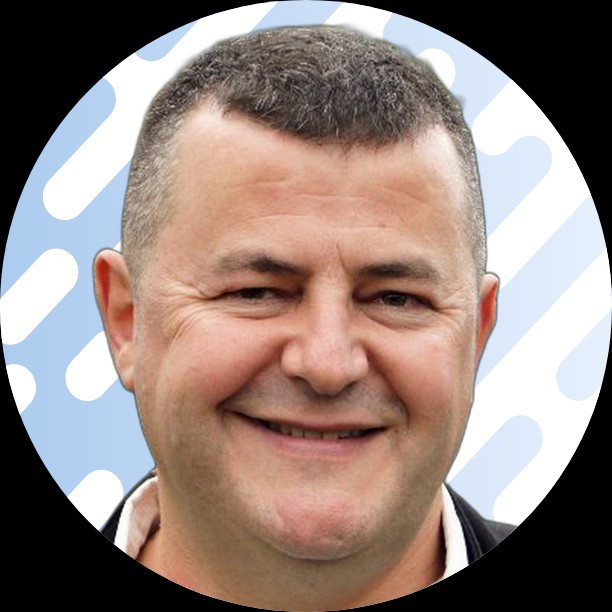
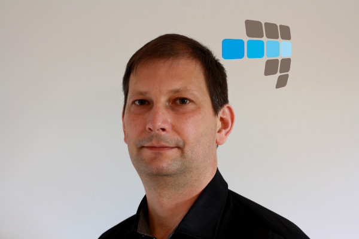

  

    

      <h1 class="page-header" style="border-bottom: 4px solid #337ab7; color: #337ab7; margin-bottom: 30px;">
        A propos du PG Day France
      </h1>
      
      

        Le PG Day France est un moment de rencontres et de conférences pour la communauté francophone de PostgreSQL.
      

      

        Les conférences s'adressent à toutes les personnes utilisatrices du logiciel :
        étudiant·es, administrateur·rices systèmes, DBA, développeur·euses, chef·fes de
        projet, décideur·euses, etc., dans le respect des valeurs énoncées dans le
        <a href="/codedeconduite">Code de Conduite</a>.
      

      

        Depuis 2008, l'événement se tient chaque année dans une ville différente, avec
        l'ambition de faire naître ou grandir une communauté locale. Les précédentes
        éditions ont eu lieu à Toulouse, Lille, Toulon, Marseille, Lyon, Nantes,
        Montpellier, et Strasbourg.
      

      

        L'évènement regroupe un ensemble de présentations, et ateliers sous les valeurs de l'Open-Source.
        Le comité de sélection est libre quant aux critères de choix des interventions.
      

      

        

           

             <h3><i class="fa fa-envelope"></i> Contact</h3>
             
Pour toute information, adressez vos messages à :

             <a href="mailto:contact@pgday.fr" class="btn btn-primary">contact@pgday.fr</a>
           

        

        

           

             <h3><i class="fa fa-heart" style="color: #d9534f;"></i> Code de Conduite</h3>
             
Nous veillons à ce que chaque personne participante vive une expérience positive.

             <a href="/codedeconduite" class="btn btn-default">Lire le Code de Conduite</a>
           

        

      

      

      <h3><i class="fa fa-money"></i> Finances</h3>
      

        L'organisation de ces journées de conférence ne serait pas possible sans le soutien
        des sponsors et la vente des billets. Si l'événement génère un excédent de recettes,
        les bénéfices seront reversés à l'association PostgreSQLFr.
      

      

        Cette association à but non lucratif a pour mission de promouvoir PostgreSQL dans
        les pays francophones. Aucun·e conférencier·ère n'est rémunéré·e pour sa présentation,
        bien que ses frais de déplacement puissent, dans certains cas, être remboursés.
      

      

        L'équipe organisatrice est quant à elle entièrement composée de bénévoles.
      

      

      <h3 style="color: #337ab7; margin-bottom: 30px;"><i class="fa fa-gavel"></i> Comité de sélection 2026</h3>
      
      

        

            

                
                

                    <h3 style="font-size: 1.5em;">Yves Colin</h3>
                    
<small>Customer Engineer Data Management</small> <strong>Google</strong>

                

            

        

        

            

                
                

                    <h3 style="font-size: 1.5em;">Bertrand Drouvot</h3>
                    
<small>PostgreSQL Major Contributor & Engineering</small> <strong>AWS</strong>

                

            

        

        

            

                
                

                    <h3 style="font-size: 1.5em;">Naeva Mallet</h3>
                    
<small>Database administrator</small> <strong>Leboncoin</strong>

                

            

        

        

            

                
                

                    <h3 style="font-size: 1.5em;">Helene Nguyen</h3>
                    
<small>Engineering Manager & Software Engineer</small> <strong>Filigran</strong>

                

            

        

      

      

      <h3 style="color: #5cb85c; margin-bottom: 30px;"><i class="fa fa-users"></i> Comité d'organisation</h3>
      
Cet évènement est organisé par des volontaires cojointement avec les membres de l'association PostgreSQLFr.

      
      

        

            
            

                
                <h4 style="margin-top: 10px; min-height: 40px; display: flex; align-items: center; justify-content: center;">Jean-Paul Argudo</h4>
            

            

                
                <h4 style="margin-top: 10px; min-height: 40px; display: flex; align-items: center; justify-content: center;">Jean-Christophe Arnu</h4>
            

            

                
                <h4 style="margin-top: 10px; min-height: 40px; display: flex; align-items: center; justify-content: center;">Sylvain Beorchia</h4>
            

            

                
                <h4 style="margin-top: 10px; min-height: 40px; display: flex; align-items: center; justify-content: center;">Damien Clochard</h4>
            

            

                
                <h4 style="margin-top: 10px; min-height: 40px; display: flex; align-items: center; justify-content: center;">Matt Cornillon</h4>
            

            

                
                <h4 style="margin-top: 10px; min-height: 40px; display: flex; align-items: center; justify-content: center;">Flavio Gurgel</h4>
            

            

                
                <h4 style="margin-top: 10px; min-height: 40px; display: flex; align-items: center; justify-content: center;">Yohann Martin</h4>
            

            

                
                <h4 style="margin-top: 10px; min-height: 40px; display: flex; align-items: center; justify-content: center;">Xavier Simon</h4>
            

            

                
                <h4 style="margin-top: 10px; min-height: 40px; display: flex; align-items: center; justify-content: center;">Anaïs Oberto</h4>
            

        

      

    

  

