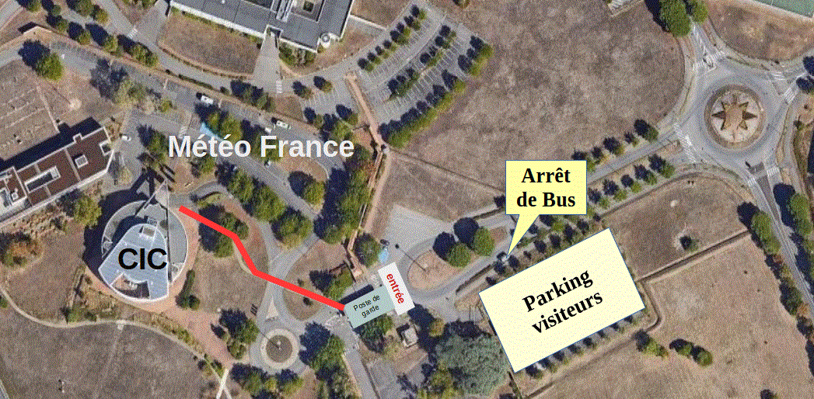
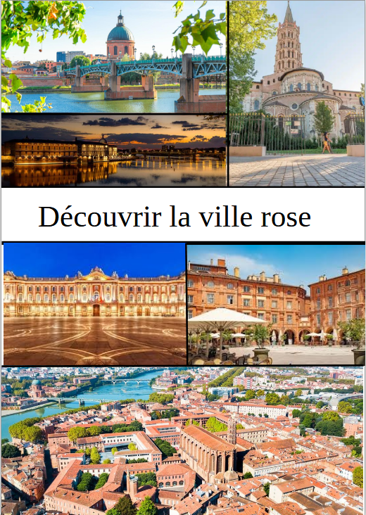
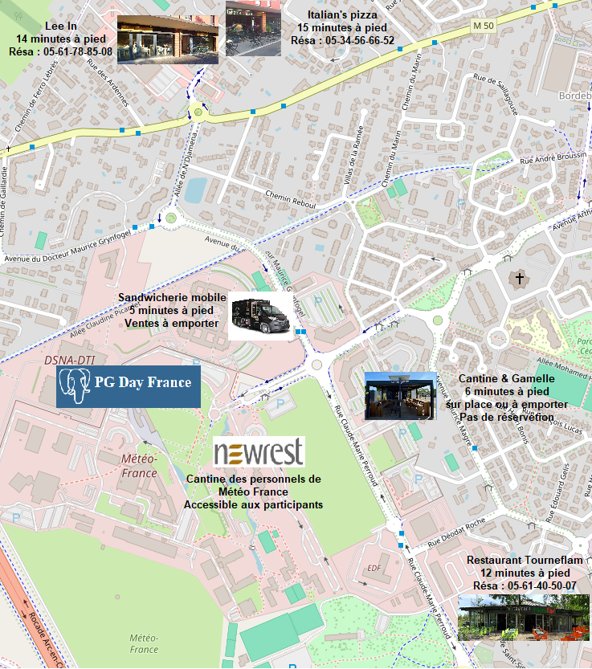
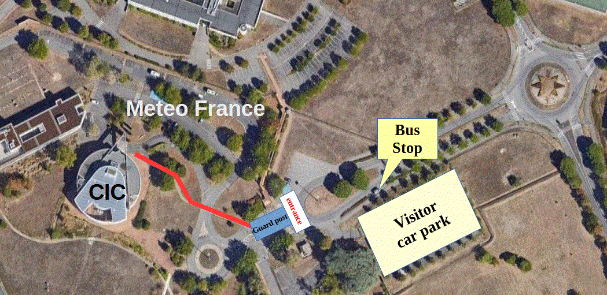
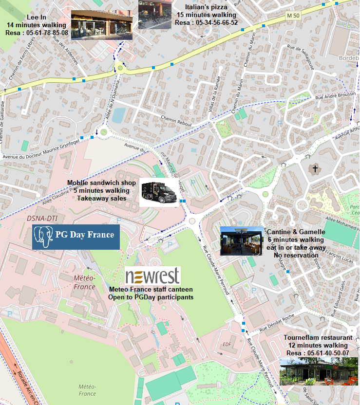

  

    

      <h1 class="page-header" style="border-bottom: 4px solid #337ab7; color: #337ab7; margin-bottom: 30px;">
        Informations Pratiques (FR)
      </h1>
      

        

          

            

              <h3 class="panel-title"><i class="fa fa-map-marker"></i> Lieu de l'événement</h3>
            

            

              
<strong>Météo France - Centre International de Conférences</strong>

              
42 avenue Gaspard Coriolis, 31100 Toulouse, France

              
<a href="http://www.meteo.fr/cic/presentation.html" target="_blank" class="btn btn-primary btn-sm">Site Web</a>

            

          

          

            

              <h3 class="panel-title"><i class="fa fa-route"></i> Comment venir ?</h3>
          

          

            

              

                <h4><i class="fa fa-train"></i> En train</h4>
                
La <strong>gare Matabiau</strong> est le point d'arrivée principal. Pour rejoindre Météo France :

                <ol>
                  <li>Prendre le <strong>métro Ligne A</strong> direction <strong>Basso Cambo</strong>.</li>
                  <li>Descendre au terminus <strong>Basso Cambo</strong>.</li>
                  <li>Prendre le <strong>bus Ligne 18</strong> direction <strong>Arènes</strong>.</li>
                  <li>Descendre à l'arrêt <strong>Météo</strong>.</li>
                </ol>
              

              

                <h4><i class="fa fa-plane"></i> En avion</h4>
                
Depuis l'aéroport de <strong>Toulouse-Blagnac</strong> :

                <ol>
                  <li>L'arrêt de bus est situé à proximité du <strong>Terminal 1</strong>, sur la <strong>droite</strong> quand on sort de l'aéroport.</li>
                  <li>Prendre le <strong>bus Ligne 31</strong> jusqu'à <strong>Pasteur - Mairie de Blagnac</strong>.</li>
                  <li>Prendre le <strong>tram T1</strong> jusqu'aux <strong>Arènes</strong>.</li>
                  <li>Continuer avec le <strong>métro Ligne A</strong> jusqu'à <strong>Basso Cambo</strong>, puis le <strong>bus 18</strong>.</li>
                </ol>
              

            

            

            

              

                <h4><i class="fa fa-car"></i> En voiture</h4>
                
Un parking gratuit est disponible sur le site de Météo France, accessible via la rocade <strong>Arc en ciel</strong>.

              

              

                <h4><i class="fa fa-ticket"></i> Transports en commun</h4>
                
Les tickets peuvent être achetés aux distributeurs (métro/tram) ou à bord des bus. Un ticket est valable pour 3 changements en 1h. Validez à chaque correspondance. Vous pouvez aussi utiliser votre carte de paiement sans contact ou votre smartphone NFC avec l'application Tisséo pour <a href="https://apps.apple.com/fr/app/tiss%C3%A9o-m%C3%A9tro-tram-bus/id818553522">iPhone</a> ou <a href="https://play.google.com/store/apps/details?id=fr.tisseo.android&hl=fr">Android</a>, en guise de ticket. Consultez le <a href="https://www.tisseo.fr/">site de web  de Tisseo</a> pour plus d'informations.

              

            

          

        

        

          

            <h3 class="panel-title"><i class="fa fa-home"></i> Hébergement</h3>
          

          

            
Situé à 450 mètres de <strong>Météo France</strong>, l'hôtel <strong>B&B Toulouse-Basso Cambo</strong> vous accueillera à un tarif préférentiel.

            
Pour toute réservation via le site Internet de l'établissement, nos participants pourront bénéficier d'une remise de 10% en précisant le code promotion <strong>PGDAY26</strong> (remise valable hors autre promotion).

            
Adresse : 12 Rue Claude-Marie Perroud - 31100 Toulouse.

            
<a href="https://www.hotel-bb.com/fr/hotel/toulouse-basso-cambo" target="_blank" class="btn btn-primary btn-sm">Réservation</a>

          

        

        

          

            <h3 class="panel-title"><i class="fa fa-bus"></i>Trajets en transports en commun</h3>
          

          

            

              

                
A titre indicatif, quelques durées de déplacements pour préparer au mieux votre venue :

              

            

            

              

                 
<strong>Aéroport</strong>

              

              

                 
-

              

              

                 
<strong>Météo France</strong>

              

              

                 
:

              
          
              

                 
52 minutes.

              
          
            

            

              
        
                 
<strong>Aéroport</strong>

              

              

                
-

              

              

                
<strong>Hotel B&B</strong>

              

              

                
:

              
          
              

                
55 minutes.

              

            

            
        
              

                
<strong>Aéroport</strong>

              

              

                
-

              

              

                
<strong>Place du Capitole</strong>

              

              

                
:

              

              

                
42 minutes.

              

            

            
      
              

                
<strong>Gare Matabiau</strong>

              

              

                
-

              

              

                
<strong>Météo France</strong>

              

              

                
:

              

              

                
33 minutes.

              
 
            

            
        
              

                
<strong>Gare Matabiau</strong>

              

              

                
-

              

              

                
<strong>Hotel B&B</strong>

              

              

                
:

              

              

                
36 minutes.

              
 
            

            
        
              

                
<strong>Gare Matabiau</strong>

              

              

                
-

              

              

                
<strong>Place du Capitole</strong>

              

              

                
:

              

              

                
12 minutes.

              
 
            

            
        
              

                
<strong>Météo France</strong>

              

              

                
-

              

              

                
<strong>Hotel B&B</strong>

              

              

                
:

              

              

                
5 minutes.

              
        
            

            
        
              

                
<strong>Météo France</strong>

              

              

                
-

              

              

                
<strong>Place du Capitole</strong>

              

              

                
:

              

              

                
29 minutes.

              
        
            

            
        
              

                
<strong>Météo France</strong>

              

              

                
-

              

              

                
<strong>Soirée Communautaire</strong>

              

              

                
:

              

              

                
35 minutes.

              

            

            

            

              
              
                
Fréquence bus <strong>Ligne 31</strong> (qui dessert l'aéroport) : toutes les 10 minutes.

                
Fréquence bus <strong>Ligne 18</strong> (qui dessert Météo France) : toutes les 15 minutes en moyenne.

                
Fréquence tramway <strong>Ligne T1</strong> : toutes les 6 minutes.

                
Fréquence métro <strong>Ligne A</strong> : toutes les 15 minutes.

              

            

            

            

              
              
                
Données source Tisséo. Pour organiser votre trajet :

                
<a href="https://www.tisseo.fr/se-deplacer/itineraires" target="_blank" class="btn btn-primary btn-sm">Tisséo</a>

              

            

          

        

      

      

        

            

                <h3 class="panel-title"><i class="fa fa-globe"></i> Carte</h3>
            

            

                <iframe width="100%" height="250" frameborder="0" scrolling="no" marginheight="0" marginwidth="0" src="https://www.openstreetmap.org/export/embed.html?bbox=1.3664352893829346%2C43.57407184501379%2C1.384352445602417%2C43.58078722900235&amp;layer=mapnik"></iframe>
                <small><a href="https://www.openstreetmap.org/?#map=17/43.577430/1.375394" target="_blank">Afficher une carte plus grande</a></small>
            

        

        

          

            <h3 class="panel-title"><i class="fa fa-road"></i> Accès au site</h3>
          

          

            
            <strong><h4 style="color:#FF0000;"><u>A noter :</u></h4>
            
Météo France est un site sécurisé. Une pièce d'identité vous sera demandée.
</strong>
          

        

        

          

            <h3 class="panel-title"><i class="fa fa-search"></i> Visiter la Ville Rose</h3>
          

          

            

          

        

        

          

            <h3 class="panel-title"><i class="fa fa-beer"></i>  Restauration</h3>
          
          
          

            

          

        

      

    

    

    <h1 class="page-header" style="border-bottom: 4px solid #337ab7; color: #337ab7; margin-bottom: 30px;">
      Practical Information (EN)
    </h1>
    

      

        

          

            <h3 class="panel-title"><i class="fa fa-map-marker"></i> Venue</h3>
          

          

            
<strong>Météo France - International Center of Conferences</strong>

            
42 avenue Gaspard Coriolis, 31100 Toulouse, France

            
<a href="http://www.meteo.fr/cic/presentation.html" target="_blank" class="btn btn-primary btn-sm">Website</a>

          

        

        

          

            <h3 class="panel-title"><i class="fa fa-route"></i> How to Get There</h3>
          

          

            

              

                <h4><i class="fa fa-train"></i> By Train</h4>
                
The main arrival point is <strong>Matabiau station</strong>. To reach Météo France:

                <ol>
                  <li>Take <strong>Metro Line A</strong> towards <strong>Basso Cambo</strong>.</li>
                  <li>Get off at the terminus <strong>Basso Cambo</strong>.</li>
                  <li>Take <strong>Bus Line 18</strong> towards <strong>Arènes</strong>.</li>
                  <li>Get off at the <strong>Météo</strong> stop.</li>
                </ol>
              

              

                <h4><i class="fa fa-plane"></i> By Plane</h4>
                
From <strong>Toulouse-Blagnac Airport</strong>:

                <ol>
                  <li>The bus station is near the <strong>Terminal 1</strong>, on the <strong>right</strong> when you leave the airport.</li>
                  <li>Take <strong>Bus Line 31</strong> to <strong>Pasteur - Mairie de Blagnac</strong>.</li>
                  <li>Take <strong>Tram T1</strong> to <strong>Arènes</strong>.</li>
                  <li>Continue with <strong>Subway Line A</strong> to <strong>Basso Cambo</strong>, then take <strong>Bus 18</strong>.</li>
                </ol>
              

            

            

            

              

                <h4><i class="fa fa-car"></i> By Car</h4>
                
Free parking is available at the Météo France site, accessible via the <strong>Arc en ciel</strong> ring road.

              

              

                <h4><i class="fa fa-ticket"></i> Public Transport</h4>
                
Tickets can be purchased from vending machines (metro/tram) or on buses. One ticket is valid for 3 transfers within 1 hour. Please validate your ticket at each connection. You also can use your contactless credit/debit card or your NFC compatible smartphone with the Tisséo app for <a href="https://apps.apple.com/fr/app/tiss%C3%A9o-m%C3%A9tro-tram-bus/id818553522">iPhone</a> or <a href="https://play.google.com/store/apps/details?id=fr.tisseo.android&hl=fr">Android</a> instead of a ticket. Check-out the <a href="https://www.tisseo.fr/">Tisseo website</a> for more information.

              

            

          

        

        

          

            <h3 class="panel-title"><i class="fa fa-home"></i> Accommodation</h3>
          

          

            
Located 450 meters from <strong>Météo France</strong>, the <strong>B&B Toulouse-Basso Cambo</strong> hotel will welcome you at a preferential rate.

            
For all bookings made via the establishment's website, our participants can benefit from a 10% discount by specifying the promotional code <strong>PGDAY26</strong> (discount available excluding other promotions).

            
Address : 12 Rue Claude-Marie Perroud - 31100 Toulouse.

            
<a href="https://www.hotel-bb.com/fr/hotel/toulouse-basso-cambo" target="_blank" class="btn btn-primary btn-sm">Booking</a>

          

        

        

          

            <h3 class="panel-title"><i class="fa fa-bus"></i>Journeys by public transport</h3>
          

          

            

              

                
For your information, some estimated travel times to help you plan your visit :

              

            

            

              

                 
<strong>Airport</strong>

              

              

                 
-

              

              

                 
<strong>Météo France</strong>

              

              

                 
:

              
          
              

                 
52 minutes.

              
          
            

            

              
        
                 
<strong>Airport</strong>

              

              

                
-

              

              

                
<strong>B&B Hotel</strong>

              

              

                
:

              
          
              

                
55 minutes.

              

            

            
        
              

                
<strong>Airport</strong>

              

              

                
-

              

              

                
<strong>Capitole square</strong>

              

              

                
:

              

              

                
42 minutes.

              

            

            
      
              

                
<strong>Matabiau station</strong>

              

              

                
-

              

              

                
<strong>Météo France</strong>

              

              

                
:

              

              

                
33 minutes.

              
 
            

            
        
              

                
<strong>Matabiau station</strong>

              

              

                
-

              

              

                
<strong>B&B Hotel</strong>

              

              

                
:

              

              

                
36 minutes.

              
 
            

            
        
              

                
<strong>Matabiau station</strong>

              

              

                
-

              

              

                
<strong>Capitole square</strong>

              

              

                
:

              

              

                
12 minutes.

              
 
            

            
        
              

                
<strong>Météo France</strong>

              

              

                
-

              

              

                
<strong>B&B Hotel</strong>

              

              

                
:

              

              

                
5 minutes.

              
        
            

            
        
              

                
<strong>Météo France</strong>

              

              

                
-

              

              

                
<strong>Capitole square</strong>

              

              

                
:

              

              

                
29 minutes.

              
        
            

            
        
              

                
<strong>Météo France</strong>

              

              

                
-

              

              

                
<strong>Community evening event</strong>

              

              

                
:

              

              

                
35 minutes.

              

            

            

            

              
              
                
Bus frequency <strong>Line 31</strong> (which serves the airport) : every 10 minutes.

                
Bus frequency <strong>Line 18</strong> (which serves Météo France) : every 15 minutes on average.

                
Tram frequency <strong>Line T1</strong> : every 6 minutes.

                
Subway frequency <strong>Line A</strong> : every 15 minutes.

              

            

            

            

              
              
                
Data source from Tisséo. To plan your journey :

                
<a href="https://www.tisseo.fr/se-deplacer/itineraires" target="_blank" class="btn btn-primary btn-sm">Tisséo</a>

              

            

          

        

       

      

        

          

            <h3 class="panel-title"><i class="fa fa-globe"></i> Map</h3>
          

          

            <iframe width="100%" height="250" frameborder="0" scrolling="no" marginheight="0" marginwidth="0" src="https://www.openstreetmap.org/export/embed.html?bbox=1.3664352893829346%2C43.57407184501379%2C1.384352445602417%2C43.58078722900235&amp;layer=mapnik"></iframe>
            <small><a href="https://www.openstreetmap.org/?#map=17/43.577430/1.375394" target="_blank">View larger map</a></small>
          

        

        

          

            <h3 class="panel-title"><i class="fa fa-road"></i> Site Access</h3>
          

          

            
            <strong><h4 style="color:#FF0000;"><u>Important to know :</u></h4>
            
Meteo France is a secure site. You will be asked to provide proof of identity.
</strong>
          

        

        

          

            <h3 class="panel-title"><i class="fa fa-search"></i> Discover the Pink City</h3>
          

          

            

          

        

        

          

            <h3 class="panel-title"><i class="fa fa-beer"></i>  Restaurants near event</h3>
          

          

            

          

        

      

    

