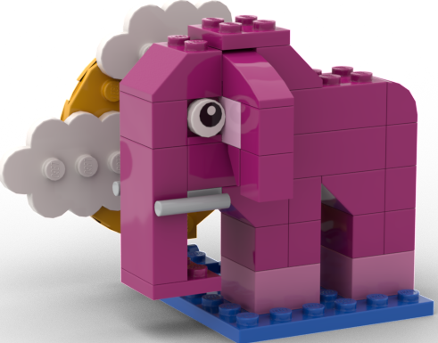
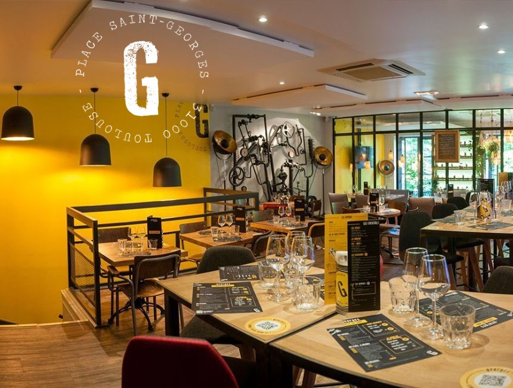
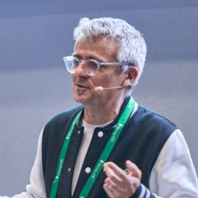

# Programme / Schedule

## Mercredi 3 juin 2026 / Wednesday, June 3rd, 2026

  
08h00

  

  
  

  
<h3>Ouverture des portes / Doors open</h3>

  
09h00

  

  <i class="fa fa-laptop"></i>
  

  

  <h3>Atelier: PgBouncer - Everything, Everywhere, All At Once About This Tool (EN)</h3>
  
Machytka Josef - <a href="https://www.credativ.de/en/">Credativ</a>

  
PostgreSQL connections are expensive, their number is the limiting factor for performance and stability. Connection pooling is a primary scaling tool for modern systems. We all know it, but do we really understand why? We will dive into PostgreSQL and Linux architecture, explaining the concrete costs of “too many connections” in PostgreSQL’s process-per-connection model.
Second part is dedicated to PgBouncer. We will examine how its current single‑threaded event loop works and outline the proposed multithreaded approach. We will cover practical and experimental use cases and the configuration edges that matter in production—like scaling.
  

  
<i>Entrée libre dans la limite des places disponibles. / Free entry subject to availability.</i>

  

  
09h00

  

  <i class="fa fa-laptop"></i>
  

  

  <h3>Atelier: Développer une extension Postgres en Rust (FR)</h3>
  
Damien Clochard - <a href="https://www.dalibo.com/">Dalibo</a>

  

Cet atelier est consacré au framework PGRX, un environnement de développement qui facilite la conception d'extensions PostgreSQL avec le langage Rust. Avec une succession d'exercices concrets et progressifs, nous verrons les avantages du langage Rust pour intégrer du code au plus près de vos données.
  

  
<i>Entrée libre dans la limite des places disponibles. / Free entry subject to availability.</i>

  

  
12h00

  

  <i class="fa fa-spinner"></i>
  

  

  <h3>Pause / Lunch break</h3>
  
Le repas du mercredi midi n'est pas inclus. Une pause est prévue pour se restaurer à l'extérieur. Merci de votre compréhension.

  
Wednesday lunch is not included. A break is scheduled so participants can eat outside. Thank you for your understanding.

  

  
13h30

  

  
  

  

  <h3>Ré-Ouverture des portes / Doors reopen</h3>
  

  
14h00

  

  <i class="fa fa-laptop"></i>
  

  

  <h3>Atelier: Créez votre premier agent IA avec PostgreSQL</h3>
  
Matt Cornillon - <a href="https://www.google.com/">Google</a>

  

Dans cet atelier pratique, bâtissez de bout en bout un agent IA s'appuyant sur PostgreSQL. L'objectif : déployer un serveur MCP pour exposer vos fonctions et requêtes SQL comme des outils ("tools") actionnables par un LLM.

Au programme:
- Architecture MCP : Liaison entre l'IA et le moteur SQL.
- SQL as a Tool : Transformer vos requêtes en capacités cognitives.
- Sécurité & Gouvernance : Maîtriser l'accès aux données (RLS, vues, permissions).

Cas pratique : Création d'un agent expert météo capable d'analyser vos historiques climatiques et de répondre aux questions des utilisateurs directement depuis vos tables.
  

  
<i>Entrée libre dans la limite des places disponibles. / Free entry subject to availability.</i>

  

  
14h00

  

  <i class="fa fa-laptop"></i>
  

  

  <h3>Atelier: Rafraîchir les données de développement avec anonymisation dans CloudNativePG</h3>
  
Julien Acroute - <a href="https://www.camptocamp.com/">camptocamp</a>

  

Dans nos workflows de développement, le chemin de promotion du code est désormais bien balisé. Pourtant, dès qu'on parle de données, tout se complique : le chemin inverse (Prod -> Dev) reste souvent le parent pauvre de l’automatisation. Rafraîchir une base de développement rime encore trop souvent avec "ouverture de ticket", "restauration lente" ou compromis sur la confidentialité des données.

Cette session propose une mise en pratique d'un rafraîchissement à la demande avec CloudNativePG et postgresql_anonymizer. Elle prouve qu'avec les bons outils, on peut offrir des environnements de test fidèles et anonymisés en quelques secondes.
  

  
<i>Entrée libre dans la limite des places disponibles. / Free entry subject to availability.</i>

  

## Grande soirée communautaire / Community Reception

  
19h30 - 23h00

    

  
  

  

  <h3>Grande soirée ouverte à tous·tes et incluse dans le prix de votre billet.</h3>
  
Tous les participant·e·s, sponsors et orateurs·rices se retrouvent pour une grande soirée de rencontre et de partage autour d'un apéritif dînatoire au coeur de la ville rose, à 10 minutes de la place du Capitole.

  
Lieu de Rendez-vous : <strong>Restaurant Monsieur Georges</strong>, 20 Place Saint-Georges, 31000 TOULOUSE

   
  <h3>Community reception included in the price of your ticket.</h3>
  
All participants, sponsors, and speakers are invited to gather for a vibrant evening of connection and sharing over a standing dinner reception in the heart of the Pink City, at 10 minutes from the Capitole square.

  
Location: <strong>Monsieur Georges Restaurant</strong>, 20 Place Saint-Georges, 31000 TOULOUSE

  
<strong>COMMUNITY EVENT SPONSOR</strong> 

  

## Jeudi 4 juin 2026 / Thursday, June 4th, 2026

  
08h00

  

  
  

  

  <h3>Ouverture des portes / Doors open</h3>
  

 
  
09h00

  
 
  
  
 
  

  <h3>Mot d'accueil / Welcome speech</h3>
  

  
09h15

  

  
  

  

  <h3>Rendre 700 développeurs autonomes sur PostgreSQL grâce à l'IA : Premiers retours (FR)</h3>
  
Par <a href="orateurs#w_roset" class="pg_speaker_name">Wilfried Roset</a> - OVH Cloud

  

Notre équipe DBA chez OVHcloud était submergée par 700+ développeurs posant sans cesse les mêmes questions : "C'est quoi ce schéma ?", "Aide-moi avec cette jointure ?", "Pourquoi c'est lent ?"

Nous avons construit Luke, une passerelle MCP permettant aux agents IA d'introspecter nos bases PostgreSQL. Découvrez comment l'IA transforme les workflows (de "j'attends le DBA" à "autonomie totale"), les patterns d'adoption émergents, et surtout les leçons apprises. Trois mois après le début, nous partagerons un retour d'expérience honnête sur ce qui fonctionne, ce qui surprend, et ce qu'on n'avait pas anticipé.
  

  <!--
<a href="docs/2026/.pdf">Slides</a>
-->
  

  
09h45

  

  
  

  

  <h3>Explaining Transaction Isolation Levels (FR)</h3>
  
Par <a href="orateurs#f_delacourt" class="pg_speaker_name">Frédéric Delacourt</a> - Data Bene

  

Transaction isolation defines how the RDBMS must behave under concurrent processing.
For each level defined by the SQL standard we shall see:

* Show expectations from the level
* Show typical use cases
* Discuss typical errors due to concurrency
* Show PostgreSQL internals on how it works under the hood
* Discuss performance impacts and improvement where it makes sense

Can we mix several Isolation Levels.

We shall talk about snapshots, tuple structure and locking. Also, we shall dig all isolation levels to shade light on SERIALIZABLE which is seldom used by developers.

After this talk you should be able to choose confidently the right level for the right context.  
  

  <!--
<a href="docs/2026/.pdf">Slides</a>
-->
  

  
10h30

  

  
  

  

  <h3>Pause / Coffee break</h3>
  

  
11h00

  

  
  

  

  <h3>Building a Truly Compatible Postgres Proxy: The Multigres Story (EN)</h3>
  
Par <a href="orateurs#h_gupta" class="pg_speaker_name">Haritabh Gupta</a> - supabase

  

What does it take to build a Postgres proxy that applications can't tell apart from vanilla Postgres? In this talk, I share lessons from building Multigres, a horizontally-scalable Postgres proxy. I walk through the real compatibility challenges we faced: implementing COPY FROM as a streaming state machine, managing session state and transactions with connection pooling, preserving all Postgres error diagnostic fields through a gRPC stack, handling TLS negotiation, forwarding NOTICE messages, and forwarding client startup parameters. Then we'll see how Postgres's regression and isolation test suites help to measure and prove what it truly means to be a transparent Postgres proxy.
  

  <!--
<a href="docs/2026/.pdf">Slides</a>
-->
  

  
11h45

  

  
  

  

  <h3>Repas / Lunch</h3>
  

  
13h30

  

  
  

  

  <h3>Lightning Talks</h3>
  

    Une série de lightning talks de 5 minutes. Chaque participant au PG Day peut choisir le sujet de son choix (technique ou non) et le présenter en 5 minutes top chrono ! :)
     Envoyez vos propositions à <a href="mailto:contact@pgday.fr">contact@pgday.fr</a>
  

  

    A series of 5-minute lightning talks. Each PG Day participant is welcome to choose any topic (technical or not) and present it in exactly 5 minutes, stopwatch-style! :)
     Send your proposals to <a href="mailto:contact@pgday.fr">contact@pgday.fr</a>
  

  

  
14h00

  

  
  

  

  <h3>Workload Fingerprints: The precision metric for autonomous PostgreSQL tuning (EN)</h3>
  
Par <a href="orateurs#l_nardi" class="pg_speaker_name">Luigi Nardi</a> - DBTune

  

A PostgreSQL database is a sea of noise. Traditional performance indicators miss shifting query frequencies or transient background tasks. This session explores the Workload Fingerprint, a novel observability approach providing the granular accuracy required for autonomous optimization. We will deconstruct this methodology to answer the hard questions of production tuning: prioritizing truly critical queries, isolating environmental noise, blending diverse data into a stable baseline, and verifying persistent performance gains. This talk offers a roadmap for moving from "gut-feel" tuning to a fingerprint-based methodology that ensures every optimization is a step in the right direction.
  

  

  
14h45

  

  
  

  

  <h3>Domain‑Driven Design, ORMs, et Developer Experience avec PostgreSQL (FR)</h3>
  
Par <a href="orateurs#f_pachot" class="pg_speaker_name">Franck Pachot</a> - mongoDB

  

Les bases relationnelles ont été conçues pour être centrales et inclure la logique métier, partagées par plusieurs applications via schémas normalisés, contraintes d’intégrité et procédures stockées. Aujourd’hui, les architectures orientées services dominent : chaque équipe gère son service, son domaine fonctionnel et utilise souvent une base dédiée. Avec le DDD, la logique métier est dans l’application. PostgreSQL reste un bon candidat pour le modèle « une base par service », via un ORM ou avec des agrégats stockés en JSONB.
Le but de cette session est de mieux comprendre le développement d’applications modernes et de faciliter la communication Dev- DBA.
  

  

  
15h30

  

  
  

  

  <h3>Pause / Coffee Break</h3>
  

  
16h00

  

  
  

  

  <h3>Partitioning PostgreSQL : quand il n’y a pas de DBA (FR)</h3>
  
Par <a href="orateurs#v_mercier" class="pg_speaker_name">Vincent Mercier</a> - Amazon

  

Lorsqu’on parle de scalabilité, le partitioning arrive vite dans la discussion.
En pratique, sa conception et son exploitation sont généralement confiées aux DBA… lorsqu’il y en a. Mais que se passe-t-il dans les équipes où le rôle de DBA n’existe pas ?
Je reviendrai sur une approche pragmatique du partitioning, pensée pour des équipes majoritairement de développeurs.
Je présenterai un outil open source que nous avons développé chez Qonto pour rendre le partitioning accessible.
L’objectif de ce talk est de démystifier le partitioning, de montrer ses limites, et de proposer des patterns concrets pour l’utiliser efficacement dans des environnements où l’expertise base de données est rare.
  

  

  
16h45

  

  
  

  

  <h3>Mot de clôture / Closing session</h3>
  

  
17h30

  

  <h3>The End</h3>
  

